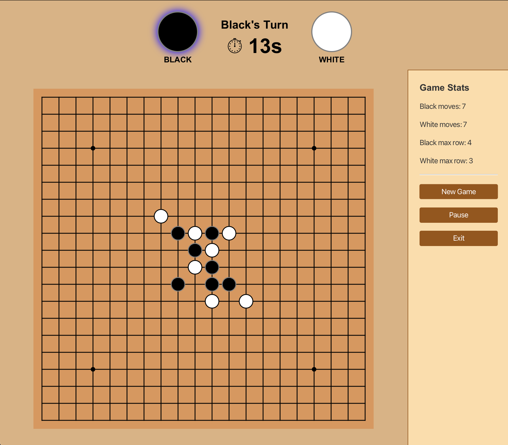
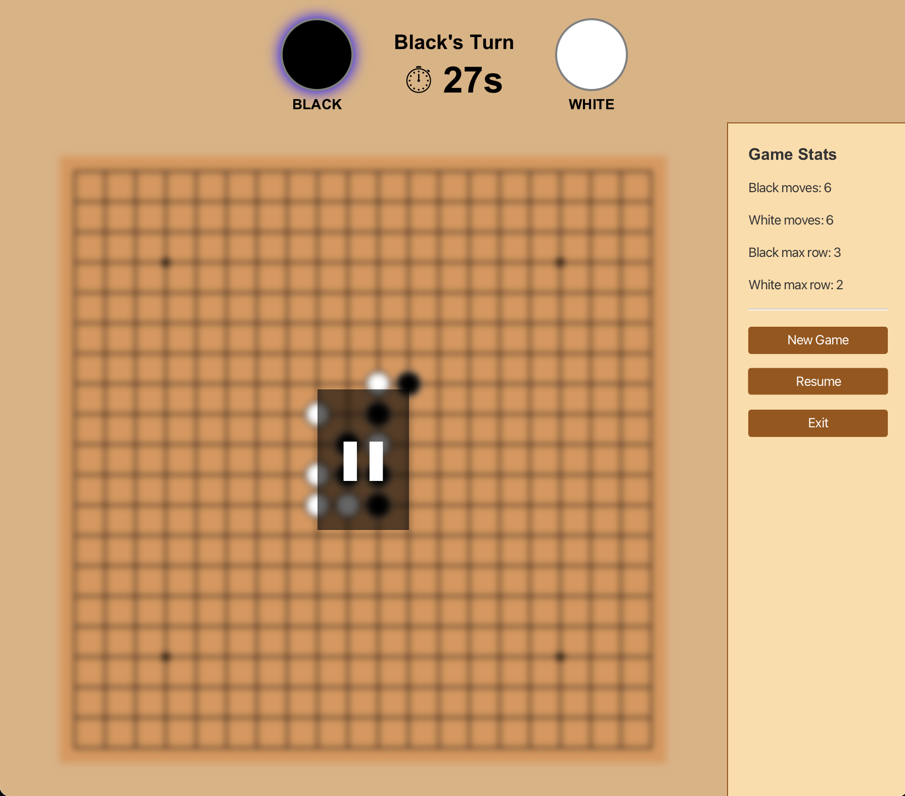

# Gomoku Game

A classic Gomoku (five in a row) game built in Java using Maven and JavaFX.


## How to Run

Requires Java and Maven (with JavaFX configured via the project's `pom.xml`).

**1. Running with IntelliJ IDEA:**
Open the project in IntelliJ and run `GomokuGameFX.java`.

**2. Running from the Command Line:**
Navigate to the project directory and run
```bash
mvn clean javafx:run
```


## Features

- Graphical user interface built with JavaFX
- Two-player gameplay on a Gomoku board
- Mouse-based stone placement
- Win detection for five in a row
- Restart and pause functionality
- Countdown timer per turn
- Stats panel showing move counts and longest unbroken row for each player 


## Game Rules

- Two players take turns placing stones on the board.
- A player who runs out of time loses their turn and the other player can play their turn.
- The first player to align five consecutive pieces horizontally, vertically, or diagonally wins.


## Screenshots

| Gameplay | Pause | Win |
|----------|----------|----------|
|  |  |  |

